<div align="center">


</div>

<br/>

<div align="center">

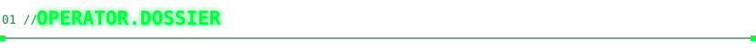

<a href="https://github.com/Kaushik2210?tab=repositories"></a>

<sub>🧬 that's me, rebuilt from my avatar into glyphs on every run. the stats beside it are live from the GitHub API, no third-party widgets.</sub>

</div>

<br/>

<div align="center">

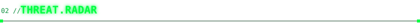

<a href="https://github.com/Kaushik2210?tab=repositories&sort=updated">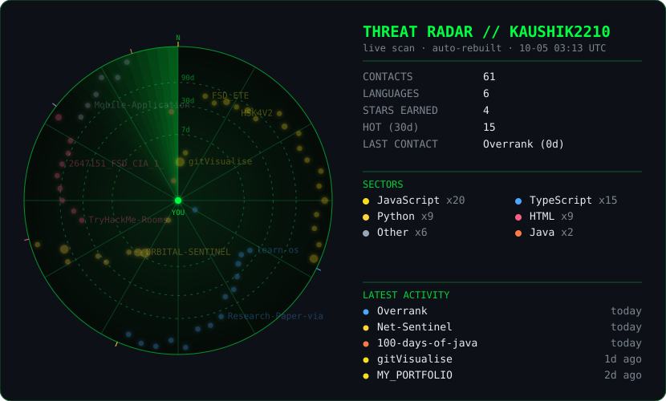</a>

<sub>🛰️ not a screenshot: a live scan of my repos, regenerated every 6 hours by <code>scripts/radar.py</code>.<br/>closer to the centre = pushed more recently · each blip flashes when the sweep passes it</sub>

</div>

<br/>

<div align="center">

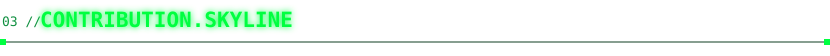

<a href="https://github.com/Kaushik2210#js-contribution-activity"></a>

<sub>🏙️ my contribution graph, extruded into a city. one building per day, height = commits, windows light up as it rises. the beacon marks my busiest day.</sub>

</div>

<br/>

<div align="center">

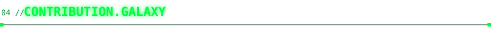

<a href="https://github.com/Kaushik2210/Kaushik2210/issues/new?template=star.yml"></a>

<sub>🌌 one star per day for the last year, laid out on a golden-angle spiral. the glowing core is today.<br/><br/><b>✨ <a href="https://github.com/Kaushik2210/Kaushik2210/issues/new?template=star.yml">add your own star to this galaxy</a></b>: open the form, pick a colour, and your handle orbits here too.</sub>

</div>

<br/>

<div align="center">

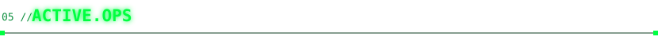

<sub>🗂️ what I'm shipping right now, newest first. click a card to expand it. rebuilt automatically every few hours.</sub>

</div>

<br/>

<!--OPS_START-->
<details>
<summary>☕ <b>100-days-of-java</b> &nbsp;·&nbsp; <code>Java</code> &nbsp;·&nbsp; ⭐ 0 &nbsp;·&nbsp; pushed today</summary>

> Daily Java practice log

[repo](https://github.com/Kaushik2210/100-days-of-java) · [commits](https://github.com/Kaushik2210/100-days-of-java/commits)

</details>

<details>
<summary>🐍 <b>Net-Sentinel</b> &nbsp;·&nbsp; <code>Python</code> &nbsp;·&nbsp; ⭐ 0 &nbsp;·&nbsp; pushed today</summary>

> No description yet. Still cooking.

[repo](https://github.com/Kaushik2210/Net-Sentinel) · [commits](https://github.com/Kaushik2210/Net-Sentinel/commits)

</details>

<details>
<summary>🟨 <b>gitVisualise</b> &nbsp;·&nbsp; <code>JavaScript</code> &nbsp;·&nbsp; ⭐ 1 &nbsp;·&nbsp; pushed today</summary>

> Paste a GitHub link, get an interactive, narrated architecture tour. Website, CLI, Claude Code skill and GitHub Action. Zero dependencies, runs in your browser. Contributors welcome.

`architecture` `architecture-diagram` `claude-code` `code-visualization` `dependency-graph` `developer-tools` &nbsp;·&nbsp; [repo](https://github.com/Kaushik2210/gitVisualise) · [live](https://kaushik2210.github.io/gitVisualise/) · [commits](https://github.com/Kaushik2210/gitVisualise/commits)

</details>

<details>
<summary>🔷 <b>Portfolio_General</b> &nbsp;·&nbsp; <code>TypeScript</code> &nbsp;·&nbsp; ⭐ 0 &nbsp;·&nbsp; pushed today</summary>

> No description yet. Still cooking.

[repo](https://github.com/Kaushik2210/Portfolio_General) · [live](https://portfolio-general-ten.vercel.app) · [commits](https://github.com/Kaushik2210/Portfolio_General/commits)

</details>

<details>
<summary>📦 <b>HireOS</b> &nbsp;·&nbsp; <code>misc</code> &nbsp;·&nbsp; ⭐ 0 &nbsp;·&nbsp; pushed 3d ago</summary>

> No description yet. Still cooking.

[repo](https://github.com/Kaushik2210/HireOS) · [commits](https://github.com/Kaushik2210/HireOS/commits)

</details>

<details>
<summary>🔷 <b>Overrank</b> &nbsp;·&nbsp; <code>TypeScript</code> &nbsp;·&nbsp; ⭐ 0 &nbsp;·&nbsp; pushed 6d ago</summary>

> Live house-competition platform for campuses: teams earn points, the leaderboard reacts in real time, faculty run the season. Next.js, TypeScript, Supabase.

`education` `framer-motion` `gamification` `leaderboard` `nextjs` `supabase` &nbsp;·&nbsp; [repo](https://github.com/Kaushik2210/Overrank) · [live](https://overrank.vercel.app) · [commits](https://github.com/Kaushik2210/Overrank/commits)

</details>

<details>
<summary>🟨 <b>MY_PORTFOLIO</b> &nbsp;·&nbsp; <code>JavaScript</code> &nbsp;·&nbsp; ⭐ 0 &nbsp;·&nbsp; pushed 7d ago</summary>

> No description yet. Still cooking.

[repo](https://github.com/Kaushik2210/MY_PORTFOLIO) · [live](https://my-portfolio-eosin-two-r79pc1zrgg.vercel.app) · [commits](https://github.com/Kaushik2210/MY_PORTFOLIO/commits)

</details>

<details>
<summary>🐍 <b>Learn_python-</b> &nbsp;·&nbsp; <code>Python</code> &nbsp;·&nbsp; ⭐ 2 &nbsp;·&nbsp; pushed 10d ago</summary>

> No description yet. Still cooking.

[repo](https://github.com/Kaushik2210/Learn_python-) · [commits](https://github.com/Kaushik2210/Learn_python-/commits)

</details>
<!--OPS_END-->

<br/>

<div align="center">

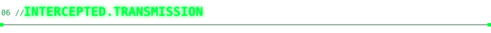

**A 3-stage CTF hidden in this profile. Crack it and your name goes in the Hall of Fame below, automatically.**

</div>

```text
STAGE 1 / 3   (base64)
U1RBR0UgMS8zIDo6IG5pY2UsIHlvdSBkZWNvZGVkIGJhc2U2NC4gdGhlIHJhZGFyIGlzIG1vcmUgdGhhbiBhIHBpY3R1cmU6IG9wZW4gYXNzZXRzL3JhZGFyLnN2ZyBhcyByYXcgdGV4dCBhbmQgcmVhZCBpdHMgPGRlc2M+IGVsZW1lbnQuIGl0IGlzIGhleC4=
```

<details>
<summary><b>📜 rules + how to submit</b></summary>

<br/>

- Each stage leads to the next. The final answer is a flag shaped like `KAUSHIK{...}`.
- **Don't post the flag.** Issues are public. Instead, submit a *proof* bound to your login:
  ```bash
  echo -n "KAUSHIK{the_flag_you_found}:your-github-login" | sha256sum | cut -c1-12
  ```
  (login in lowercase, 12 hex characters out.) A leaked proof is useless to anyone else.
- 👉 [**Submit your proof**](https://github.com/Kaushik2210/Kaushik2210/issues/new?template=ctf.yml). A GitHub Action checks it and, if it's right, adds you below within a minute.
- No brute force needed. Everything you need is in this repo and my other repos' names.

</details>

<div align="center">

### `[ HALL.OF.FAME ]`

</div>

<!--HOF_START-->
_no one has cracked it yet. first blood is up for grabs._
<!--HOF_END-->

<br/>

<div align="center">

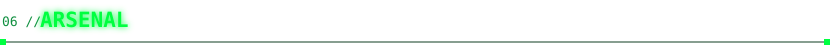


<br/><br/>


</div>

<br/>

<div align="center">

<sub>🔒 connection encrypted // session terminated gracefully</sub>

</div>
